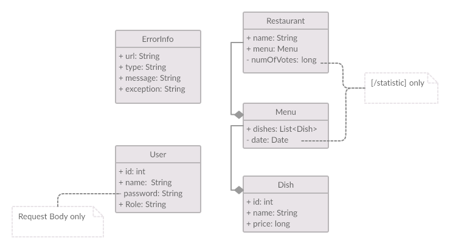

Graduation project from [TopJava online internship](https://topjava.ru/topjava)

# What is it?

Voting service for deciding where to have lunch.

 * 2 types of users: admin and regular users
 * Admin can input a restaurant and it's lunch menu of the day (2-5 items usually, just a dish name and price)
 * Menu changes each day (admins do the updates)
 * Users can vote on which restaurant they want to have lunch at
 * Only one vote counted per user
 * If user votes again the same day:
    - If it is before 11:00 we assume that he changed his mind.
    - If it is after 11:00 then it is too late, vote can't be changed
    
# How to get it?

- #### Manually
    * [Download](https://github.com/tvoe-zdorovje/topjava-graduation/archive/master.zip) and unzip the project.
    * Package to .WAR via [Maven](https://maven.apache.org/users/index.html) <pre><i>../topjava-graduation$</i> <b>mvn package</b></pre>
    * [Deploy `../topjava-graduation/target/topjava-graduation.war` to servlet container manually](https://tomcat.apache.org/tomcat-8.0-doc/deployer-howto.html#Deployment_on_Tomcat_startup)
        or use [Cargo-maven2-plugin](https://codehaus-cargo.github.io/cargo/Maven2+plugin.html): <pre><i>../topjava-graduation$</i> <b>mvn cargo:run</b></pre>  
- #### Quickly (via [Docker](https://www.docker.com))
    * Run: <pre>docker run -p 8080:8080 tvoezdorovje/topjava-graduation:1.0</pre>
    
    
# How to use it?

There are five classes of entities:

A little about `ErrorInfo`: `ErrorInfo` entity provides a short description of the error that occurred.
There are six types of errors:

|          Type         | HTTP code | Cause          |
|-----------------------|-----------|----------------|
|Temporarily unavailable|    423    | *voting after 11:00 / changing Restaurant data after 10:00 is not available*|
|Conflict               |    409    | *violation of data integrity in the database* |
|Data error             |    422    | *request body type mismatch / illegal request data* |
|Data not found         |    422    | *requested entity does not exist* |
|Validation error       |    422    | *entity data is invalid* |
|Application error      |    500    | *unexpected error* |
 

### REST API
[Get to know a REST API with cURL](curl.md)  
API is also present in the [soapui-project.xml](soapui-project.xml) file - you can use [SoapUI](https://www.soapui.org) for testing (assumes step by step).

|          | Request        |               |  Response   |                 |    Access    |   |
|:--------:|----------------|:-------------:|:-----------:|:---------------:|:------------:|---|
| *Method* | *URL*          | *Body (JSON)* | *HTTP code* | *Body (JSON)*   | *HTTP Basic* |
| POST     | /users         | User          | 201         | User            |   anonymous  |
| GET      | /profile       |      -        | 200         | User            |authenticated |
| PUT      | /profile       |      User     | 204         | -               |authenticated |
| DELETE   | /profile       |               | 204         | -               |authenticated |
| GET      | /profile/vote  |               | 200\204     | Restaurant      |authenticated |
| GET      | /users         |      -        | 200         | List\<User>     |authenticated |
| GET      | /users/id{id}  |      -        | 200         | User            |authenticated |
| GET      | /users/{name}  |      -        | 200         | User            |authenticated |
| PUT      | /users/{name}  |      User     | 204         |                 |ADMIN         |
| DELETE   | /users/{name}  |      -        | 204         |      -          |ADMIN         |
| GET      | /restaurants   |      -        | 200         |List\<Restaurant>|authenticated |no `numOfVotes` and `Menu.date` fields|
| POST     | /restaurants   | Restaurant    | 201         |  Restaurant     |ADMIN         |available only until 10:00            |
| PUT      | /restaurants/{name}     | Restaurant    | 204         |  -              |ADMIN         |
| PUT      | /restaurants/{name}     | Menu          | 204         |  -              |ADMIN         |available only until 10:00   |
| DELETE   | /restaurants/{name}     | -             | 204         |  -              |ADMIN         |available only until 10:00   |
| GET      | /restaurants/{name}     | -             | 200         |  Restaurant     |authenticated |
| GET      | /restaurants/{name}/vote| -             | 200         |  number         |authenticated |
| POST     | /restaurants/{name}/vote| -             | 204         |  -              |USER          |available only until 11:00   |
| GET      | /restaurants/statistics  | -             | 200         |List\<Restaurant>|authenticated |
| GET      | /restaurants/statistics?from={yyyy-MM-dd}|-| 200       |List\<Restaurant>|authenticated |

